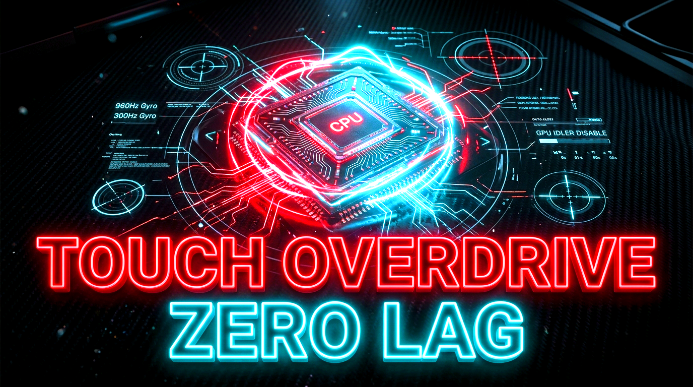

# Snapdragon-Touch-Overdrive
Ultimate KernelSU/Magisk module for POCO F7. Unlocks native 960Hz hardware gyroscope (LSM6DSV) and 300Hz touch sampling rate for competitive gaming.
# 🚀 Snapdragon Touch Overdrive | Ultimate POCO F7 Touch & Gyro Delay Fix

<p align="center">
  
</p>


An elite, kernel-level performance module engineered specifically to completely eradicate touch latency and gyroscope delay on the POCO F7. While the device features a flagship-tier Snapdragon processor, factory-imposed framework limitations and thermal throttling algorithms often bottleneck its true competitive gaming potential. 

This repository provides the definitive **gyro delay fix** and **touch lag solution** for hardcore mobile esports players (BGMI, PUBG Mobile, CODM, Wuthering Waves). By directly injecting custom sensor configurations and overriding system-level window manager protocols, this module forces the hardware to operate at its absolute physical limit, guaranteeing zero-latency crosshair tracking and instantaneous touch registration.

---

## 🎯 The Problem vs. The Solution

Out of the box, the POCO F7 features an incredible high-refresh-rate display and a top-tier touch sampling matrix. Officially, the device is marketed with high-speed instant response times activated under Game Turbo Mode. However, professional gamers frequently experience sustained input lag due to aggressive battery management and restrictive sensor polling rates enforced by the stock OS.

**Snapdragon Touch Overdrive** bypasses these software caps entirely. By mounting a custom configuration directly to the root file system via KernelSU or Magisk, it unchains the hardware from system restrictions, delivering raw, unfiltered data throughput from your fingers to the game engine.

---

## ✨ Comprehensive Feature Set

* **960Hz Gyroscope Uncap (Zero Gyro Delay Fix):** Standard software caps the gyroscope polling rate to preserve battery life, resulting in micro-delays during fast-paced sniper flicks or recoil control. This module bind-mounts a heavily modified `sm8735_lsm6dsv_0.json` configuration file at the system level. This completely unlocks the hardware's absolute maximum polling rate of 960Hz, providing flawlessly smooth and instantaneous motion tracking.
* **300Hz Sustained Touch Sampling Override:** While the hardware features an intense peak instant sampling rate, the continuous sampling rate often drops during sustained, multi-finger combat scenarios. By actively overriding the `windowsmgr.max_events_per_sec` framework property, this module forces the system to sustain a relentless 300Hz matrix cap, completely eliminating UI stutter and in-game touch lag.
* **Adreno GPU Idler Killer:** High-end Qualcomm processors utilize power-saving "idler" states that can cause micro-stutters when rendering sudden, heavy combat effects. This module strictly disables the GPU idler (`adreno_idler_active=0`), keeping the graphics processor awake and locked into high-performance states for perfectly stable frame rates.
* **Native Kernel-Level Execution:** Unlike third-party apps that drain battery in the background, this tweak runs natively via a highly optimized `service.sh` script. Because the device is equipped with a massive battery layout, the increased polling rates will have a completely negligible impact on your overall screen-on time. 

---

## ⚙️ Device Compatibility & Requirements

This module is strictly optimized for the specific hardware architecture of the POCO F7 series.

* **Target Device:** POCO F7 (Snapdragon 8s Gen 3 / SM8735)
* **Root Manager:** KernelSU Next (v3.1.0+) or Magisk (v26+)

---

## 📦 Installation Instructions

1. Navigate to the [Releases](../../releases) section of this repository.
2. Download the latest stable build: `TouchOverdrive_Release.zip`.
3. Open your root manager (Magisk or the KernelSU app).
4. Navigate to the **Modules** tab and select **Install from storage**.
5. Locate the downloaded `.zip` file and swipe/click to flash.
6. Once the terminal output reads "Flash success", tap **Reboot**.
7. Launch your game and experience true zero-latency mechanics.

---

## 🛠️ Verification & Diagnostics

You do not need to guess if the module is working; you can mathematically prove it. Once your device has fully booted, open a root-enabled terminal emulator (such as Termux) and execute the following diagnostic commands.

### Verify Touch Override Injection
Execute this command to ensure the window manager has accepted the new input ceiling:
```bash
getprop windowsmgr.max_events_per_sec
